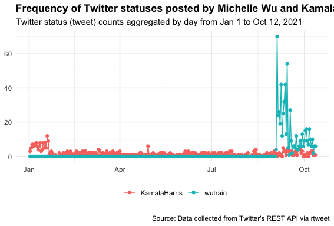

Preparation - Install packages
----------------
<pre class="r"><code>install.packages("twitteR") #installs TwitteR 
library (twitteR)#loads TwitteR
library (twitteR)
library(rtweet)
library(dplyr)
library(ggplot2)
library(tidytext)
library(httpuv)</code></pre>

Setting up your tweet token
----------------
1 - You need to get your token from [Twitter API first](https://developer.twitter.com/en/docs/twitter-api/getting-started/getting-access-to-the-twitter-api).

2 - Use your information to set up the querying request<pre class="r"><code>api_key <- "your api key" 
api_secret <- "your api_secret"
token <- "your token" 
token_secret <- "your token secret"
setup_twitter_oauth(api_key, api_secret, token, token_secret)
</code></pre>

Searching for Tweets
----------------
<pre class="r"><code>tweets <- searchTwitter("#COVID OR #community", n = 200, lang = "en")
                    # search recent 200 tweets containg #COVID or #community</code></pre>
                               
Output to a dataframe
----------------
<pre class="r"><code>tweets.df <-twListToDF(tweets)
write.csv(tweets.df, "tweets.csv")</code></pre>

Search for users
----------------
Code Source: https://rtweet.info/

<pre class="r"><code>## get user IDs of accounts you're interested in
tmls <- get_timelines(c("wutrain", "KamalaHarris"), n = 500)

## plot the frequency of tweets for each user over time
tmls %>%
  filter(created_at > "2021-01-01") %>%
  group_by(screen_name) %>%
  ts_plot("days", trim = 1L) +
  geom_point() +
  theme_minimal() +
  theme(
    legend.title = ggplot2::element_blank(),
    legend.position = "bottom",
    plot.title = ggplot2::element_text(face = "bold")) +
  labs(
    x = NULL, y = NULL,
    title = "Frequency of Twitter statuses posted by Michelle Wu and KamalaHarris",
    subtitle = "Twitter status (tweet) counts aggregated by day from Jan 1 to Oct 12, 2021",
    caption = "\nSource: Data collected from Twitter's REST API via rtweet")</code></pre>

    
Plot for displaying locations of the users you have searched for
----------------
Source: https://www.earthdatascience.org/courses/earth-analytics/get-data-using-apis/use-twitter-api-r/

<pre class="r"><code>users <- search_users("#COVID vaccine", n = 50)
users %>%
  count(location, sort = TRUE) %>%
  mutate(location = reorder(location, n)) %>%
  na.omit() %>%
  top_n(20) %>%
  ggplot(aes(x = location, y = n)) +
  geom_col() +
  coord_flip() +
  labs(x = "Count",
       y = "Location",
       title = "Where Twitter users are from - unique locations ")</code></pre>

